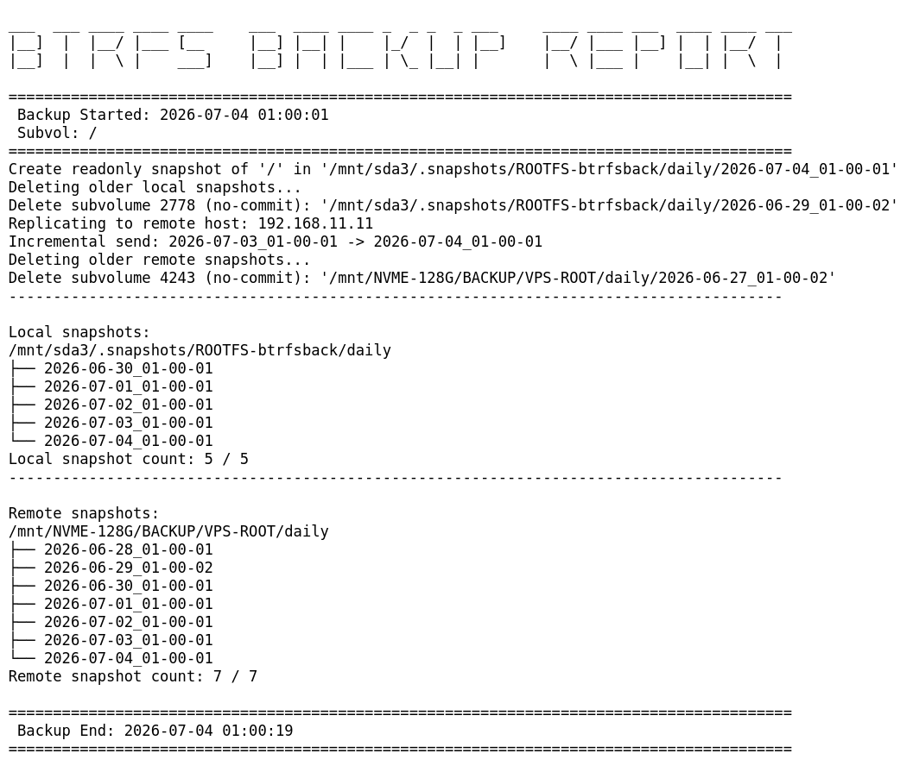
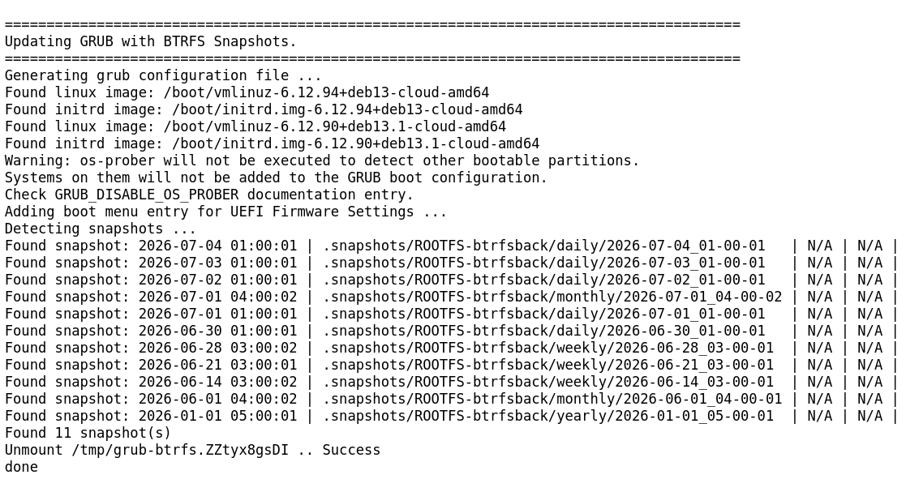
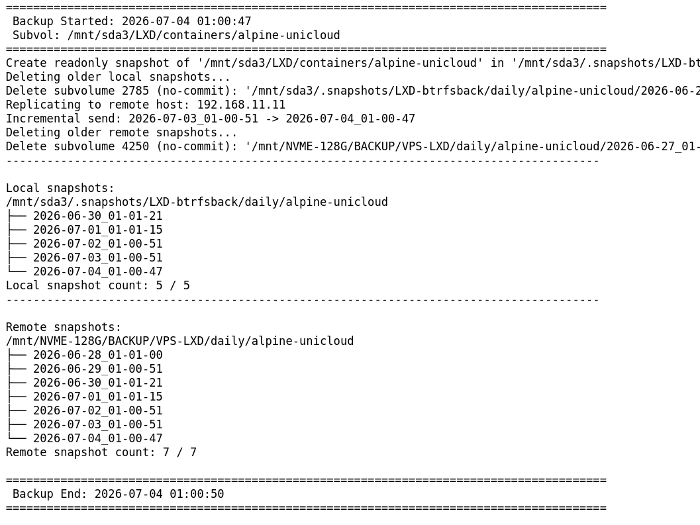
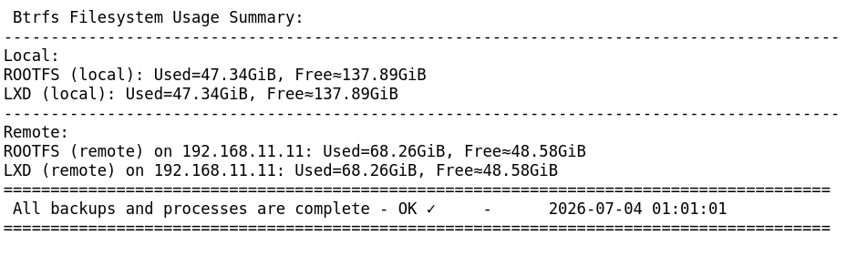

# btrfsback-lite

<p align="center">
Lightweight BTRFS snapshot and replication toolkit written in pure Bash.
</p>

<p align="center">


</p>


---





## Architecture

Snapshot → Retention cleanup → Optional replication → Email reporting → Monitoring checks → Logging
<br></br>
## Overview
```
btrfsback-lite -h
```

<br></br>

**btrfsback-lite** is a lightweight, production-ready backup and replication toolkit built entirely in **pure Bash**, relying on native **BTRFS snapshot** and **btrfs send/receive** mechanisms

It is designed for simplicity, auditability, and predictable behavior in production Linux environments.

Typical use cases:

- Root filesystem backups (/)
- LXD container snapshotting on BTRFS
- Incremental off-site replication
- Automated retention policies
- Multi-volume backup orchestration

---

## Features

| Feature | Description |
|----------|-------------|
| Incremental replication | Uses native `btrfs send/receive` |
| Snapshot automation | Scheduled snapshot creation |
| Retention management | Local and remote cleanup policies |
| Secure transfer | SSH-based replication |
| Email reporting | Execution summary after each run |
| Error visibility | Full stdout/stderr logging |
| Pure Bash | No external frameworks |
| Monitoring | Hooks for Nagios / Zabbix (Coming soon) |

---
### Prerequisites
- BTRFS filesystem
- btrfs-progs installed
- Passwordless SSH access to backup host (even with VPN)
- Pre-created destination directories
<br></br>

## Requirements

### Supported distributions:

- Ubuntu 20.04+
- Debian 11 / 12 / 13+
- Any modern Linux distributions with BTRFS support.

<br></br>
### System packages
Run as root (sudo su - / sudo -i):

```bash
apt update
apt install -y coreutils tree bsd-mailx postfix pv gawk
```

<br></br>
### Installation - btrfsback-lite
```
wget -O /usr/local/sbin/btrfsback-lite https://raw.githubusercontent.com/unix1984/btrfsback-lite/main/btrfsback-lite && wget -O /usr/local/sbin/autosnaps-btrfsback-lite.sh https://raw.githubusercontent.com/unix1984/btrfsback-lite/refs/heads/main/autosnaps-btrfsback-lite.sh && wget -O /etc/btrfsback-lite.cfg https://raw.githubusercontent.com/unix1984/btrfsback-lite/main/btrfsback-lite.cfg && chmod +x /usr/local/sbin/btrfsback-lite /usr/local/sbin/autosnaps-btrfsback-lite.sh
```
<br></br>

### Manual Usage
This configuration file defines settings for BTRFS snapshot creation and remote replication. It supports four execution profiles: DAILY, WEEKLY, MONTHLY, YEARLY.
<br></br>

Edit the config using a terminal editor:
```
vim /etc/btrfsback-lite.cfg
or
nano /etc/btrfsback-lite.cfg
```
Run the backup script with a selected profile:
```
/usr/local/sbin/autosnaps-btrfsback-lite.sh --config /etc/btrfsback-lite.cfg DAILY
/usr/local/sbin/autosnaps-btrfsback-lite.sh --config /etc/btrfsback-lite.cfg WEEKLY
/usr/local/sbin/autosnaps-btrfsback-lite.sh --config /etc/btrfsback-lite.cfg MONTHLY
/usr/local/sbin/autosnaps-btrfsback-lite.sh --config /etc/btrfsback-lite.cfg YEARLY
```

## Configuration Structure

Each profile (DAILY, WEEKLY, MONTHLY, YEARLY) defines its own variables using a common prefix pattern.

### Common Parameters

- `*_BTRFSBACK_PATH` – path to the backup script  
- `*_BTRFS_SUBVOL_ROOTFS` – root filesystem subvolume  
- `*_CONTAINERS` – LXD container directory  
- `*_LOCALDIR_*` – local snapshot storage paths  
- `*_REMOTE_IP` – remote backup host  
- `*_REMOTEDIR_*` – remote storage directories  
- `*_LSNAP_*` / `*_RSNAP_*` – retention for local/remote snapshots  
- `*_EMAIL` – report email address  
- `*_EXCLUDE_CONTAINERS` – space-separated list of excluded containers  

### Example: DAILY Section

```
DAILY_LOCALDIR_ROOTFS="/mnt/sda3/.snapshots/ROOTFS-btrfsback/daily"
DAILY_LOCALDIR_LXD="/mnt/sda3/.snapshots/LXD-btrfsback/daily"
DAILY_REMOTE_IP="192.168.11.11"
DAILY_REMOTEDIR_ROOTFS="/mnt/NVME-128G/BACKUP/VPS-ROOT/daily"
DAILY_REMOTEDIR_LXD="/mnt/NVME-128G/BACKUP/VPS-LXD/daily"
DAILY_LSNAP_ROOTFS="5"
DAILY_RSNAP_ROOTFS="7"
DAILY_LSNAP_LXD="5"
DAILY_RSNAP_LXD="7"
DAILY_EMAIL="unixit.mail@gmail.com"
```

### Email delivery notice

The first email report may occasionally be delivered to the Spam / Junk folder depending on the recipient’s mail provider.

If this happens, please mark the email as “Not spam” or move it to the inbox. This helps improve future delivery and ensures subsequent reports arrive correctly in the inbox.

<br></br>
### Cron Example
```
# BTRFS autosnap and replication scheduling.
# DAILY snapshot - every day at 01:00
0 1 * * * root /usr/local/sbin/autosnaps-btrfsback-lite.sh --config /etc/btrfsback-lite.cfg DAILY
# WEEKLY snapshot - every Sunday at 03:00
0 3 * * 0 root /usr/local/sbin/autosnaps-btrfsback-lite.sh --config /etc/btrfsback-lite.cfg WEEKLY
# MONTHLY snapshot - 1st day of each month at 04:00
0 4 1 * * root /usr/local/sbin/autosnaps-btrfsback-lite.sh --config /etc/btrfsback-lite.cfg MONTHLY
# YEARLY snapshot - January 1st at 05:00
0 5 1 1 * root /usr/local/sbin/autosnaps-btrfsback-lite.sh --config /etc/btrfsback-lite.cfg YEARLY
```
<br></br>
### Log file

Backup execution logs are written to the system log directory and can be inspected for debugging and verification purposes.

To view a specific backup run log:
```
cat /var/log/btrfsback-lite-2026-06-03_01-00-01.log
```
<br></br>
### Alternative Usage (No Config File)
Alternatively, the **btrfsback-lite** script can be executed directly from the command line without using a configuration file. This approach is completely independent of LXD, allowing you to back up any arbitrary Btrfs subvolume individually:
```
/usr/local/sbin/btrfsback-lite --subvol /mnt/sda3/containers/container1 --local-dir /mnt/sda3/autosnap/container1 --daily-local 10 --remote-host 10.5.5.4 --remote-dir /backup/container1 --daily-remote 15
/usr/local/sbin/btrfsback-lite --subvol /mnt/sda3/containers/container2 --local-dir /mnt/sda3/autosnap/container2 --daily-local 10 --remote-host 10.5.5.4 --remote-dir /backup/container2 --daily-remote 15
/usr/local/sbin/btrfsback-lite --subvol /mnt/sda3/containers/container3 --local-dir /mnt/sda3/autosnap/container3 --daily-local 10 --remote-host 10.5.5.4 --remote-dir /backup/container3 --daily-remote 15
```
### Cron Example (No Config File)
You can also schedule these individual subvolume backups directly via crontab:

```
# Daily backup of individual Btrfs subvolumes at 02:00
0 2 * * * root /usr/local/sbin/btrfsback-lite --subvol /mnt/sda3/containers/container1 --local-dir /mnt/sda3/autosnap/container1 --daily-local 10 --remote-host 10.5.5.4 --remote-dir /backup/container1 --daily-remote 15
0 2 * * * root /usr/local/sbin/btrfsback-lite --subvol /mnt/sda3/containers/container2 --local-dir /mnt/sda3/autosnap/container2 --daily-local 10 --remote-host 10.5.5.4 --remote-dir /backup/container2 --daily-remote 15
0 2 * * * root /usr/local/sbin/btrfsback-lite --subvol /mnt/sda3/containers/container3 --local-dir /mnt/sda3/autosnap/container3 --daily-local 10 --remote-host 10.5.5.4 --remote-dir /backup/container3 --daily-remote 15
```
<br></br>
<br></br>
<br></br>
## btrlb (Local-only version, no replication.)


Lightweight tool for local snapshot rotation only (no replication).
<br></br>
### Install
```
wget -O /usr/local/sbin/btrlb https://raw.githubusercontent.com/unix1984/btrfs/main/btrlb && chmod +x /usr/local/sbin/btrlb
```
<br></br>
### Example
```
btrlb --subvol / --local-dir /mnt/sda2/autosnap-test --daily-local 10
```
<br></br>
### Cron
```
30 23 * * * root /usr/local/sbin/btrlb --subvol / --local-dir /mnt/sda2/autosnap-test --daily-local 10 > /var/log/btrlb.log 2>&1
```
<br></br>
<br></br>
<br></br>
### Commercial Support
If you need professional assistance with setting up reliable Btrfs backup strategies in your production environment, corporate services are available.

Services include:

- One-time implementation & consultation - Custom deployment and integration tailored to your infrastructure, billed at an hourly rate.

- Maintenance & monitoring - Ongoing management, regular health checks, and priority support for a flat monthly fee.

For business inquiries and quotes, please contact:

<pre>
<strong>Matyi Szabolcs</strong>
Linux System Engineer

unixit.mail@gmail.com
</pre>

<br></br>
### License

MIT
